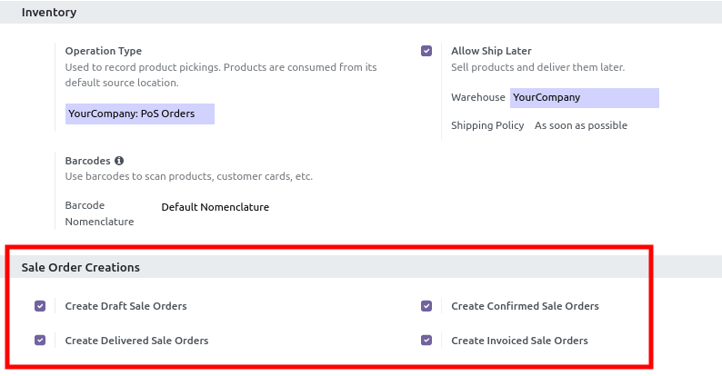

- Go to Point Of Sale / Configuration / Point of Sale
- Enable the creation options you want under **Sale Order Creation**
  (draft / confirmed / delivered / invoiced)
- Optionally set **Default Sale Order Creation**:
  - **Ask**: cashier chooses the state in the Actions → Create Order popup
  - **Draft** / **Confirmed** / **Delivered** / **Invoiced**: Create
    Order creates that sale order immediately without a popup
- Optionally enable **Create Sale Order on Customer Account Validate**:
  pay fully with Customer Account and click Validate to create a sale
  order in the Default state (must not be Ask) and show a receipt.
  No Point of Sale order is saved. The Actions → **Create Order**
  button is hidden so staff only use Validate.

