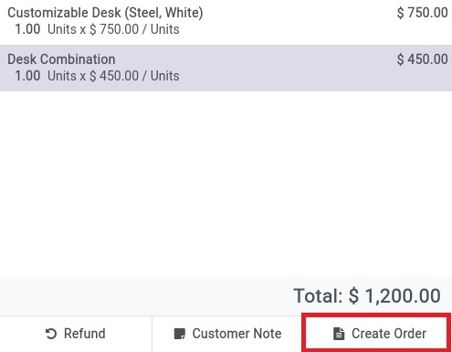
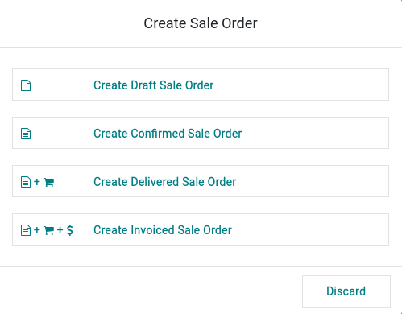

- Open your Point of Sale
- Create a new order and select products
- Select a customer
- Click on the **Create Order** button (under Actions)

What happens next depends on **Default Sale Order Creation** in the PoS
settings:

- If set to **Ask** (default), a popup offers the options enabled for
  that PoS (see below).
- If set to a concrete state (**Draft**, **Confirmed**, **Delivered**,
  or **Invoiced**), the sale order is created immediately in that state
  and the current PoS order is discarded (no popup).

When **Ask** is selected, these options can be available (depending on
the PoS settings):

- **Create a draft Order** A new sale order in a draft mode will be
  created that can be changed later.
- **Create a Confirmed Order** A new sale order will be created and
  confirmed.
- **Create Delivered Sale Order** A new sale order will be created and
  confirmed. The associated picking will be marked as delivered.
- **Create Invoiced Sale Order** A new sale order will be created and
  confirmed. The associated picking will be marked as delivered. An
  invoice will be created and confirmed.

